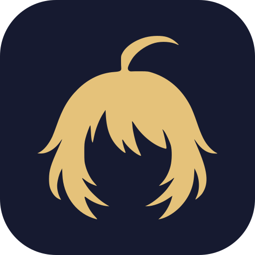
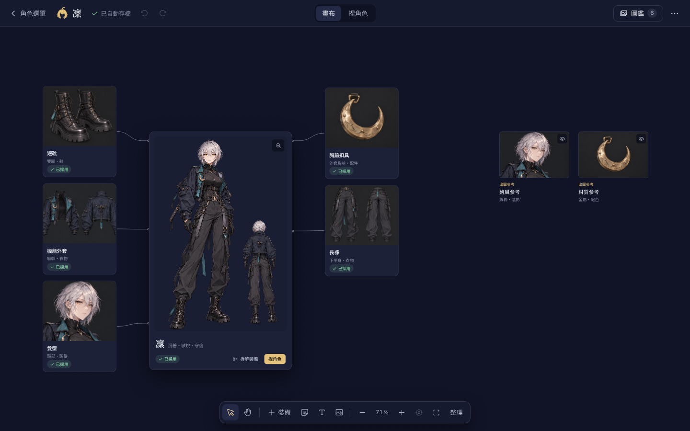
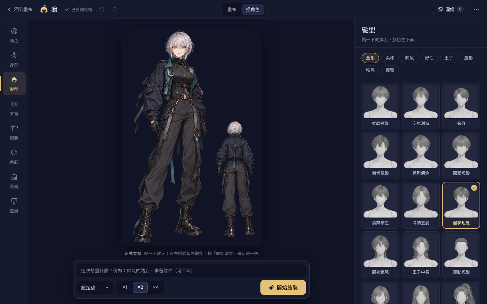

<div align="center">



<h1>AIDOL</h1>

<p><b>A character design studio for anime and game characters.</b><br>
Build a character, let Codex draw it, and keep every outfit piece on one canvas.</p>

<p>
  <a href="LICENSE"></a>
  
  
  
  
  
  <a href="https://ko-fi.com/tennosuke5245"></a>
</p>

<p><b>English</b> · <a href="README.zh-TW.md">繁體中文</a> · <a href="README.ja.md">日本語</a></p>



</div>

> The interface is available in English, Traditional Chinese and Japanese. It follows your system language, and you can switch at any time from the language menu. Profiles written by the AI are still in Traditional Chinese for now.

## What is AIDOL?

AIDOL (AI + IDOL) is a desktop app for people who design characters. You describe and tweak a character the way you would in a game's character creator. When you want a picture, AIDOL hands the job to [Codex](https://openai.com/codex/), and the finished images come back into the app for you to pick from.

Your character lives in a plain YAML file, so nothing is locked inside a chat history.

## Features

- **Canvas.** Open a character and you see the main illustration in the middle, with boots, jacket, accessories and other pieces lined up on both sides and linked to it. Drag things around; they stay where you put them.
- **Character creator.** Pick hair, bangs, eyes, body type and outfit style from thumbnails. Use sliders for age, height and hair length, and turn nine knobs to set the art style.
- **Drawing with Codex.** Press "Start drawing" (開始繪製) and AIDOL opens a new Codex chat with the request already filled in. You press send. Each image flips over on its card as it arrives, and you choose which one to keep.
- **Automatic outfit breakdown.** Once you pick a main illustration, Codex looks at it and lists what the character is wearing. Each piece shows up on the canvas, cropped from the illustration.
- **AI-written profiles.** Write a rough idea and let the AI fill in the profile. You see every change before it is applied.
- **Nothing gets lost.** Everything saves automatically, with undo/redo and a full save history. Images are never overwritten.
- **Export.** Download a character as a ZIP with its YAML, a readable profile and all images.
- **Three languages.** English, 繁體中文 and 日本語, with Japanese type for the Japanese interface.

<div align="center">

</div>

## What you need

| | Used for |
|---|---|
| Windows | The desktop app. Other systems are not tested yet. |
| [Bun](https://bun.sh/) | Running and building AIDOL |
| Codex CLI (signed in) | AI-written profiles and outfit breakdown |
| Codex App | Drawing. It uses your own subscription; AIDOL never switches to the separately billed Image API. |
| Rust + MSVC build tools | Only for building the desktop app ([Tauri prerequisites](https://tauri.app/start/prerequisites/)) |

## Download

Windows installers are on the [Releases page](https://github.com/tennosuke5245/Aidol/releases). The installer isn't code-signed yet, so Windows SmartScreen may warn you: choose **More info → Run anyway**.

To run AIDOL from source instead, see Getting started below.

## Getting started

```powershell
git clone https://github.com/tennosuke5245/Aidol.git
cd Aidol
bun install

bun run dev:core   # local core on http://127.0.0.1:4318
bun run dev        # in a second terminal: web UI on http://127.0.0.1:4173
```

To build the Windows installer:

```powershell
bun run desktop:build
```

The desktop app starts its own local service, so you don't need to run Bun or Vite yourself.

## How drawing works

AIDOL only shows what really happened. There is no fake progress bar.

1. **Ready to send.** The job is ready and Codex has a new chat open. Press send in Codex.
2. **Drawing n/N.** Codex reported that it started. `n` is how many images have come back.
3. **New images.** Real images arrived. You can pick one even while the rest are still drawing.
4. **Adopted.** The main illustration or outfit sheet is updated. Images that arrive later still go into the gallery.
5. **Didn't work this time.** Codex reported a failure and the reason. Your request is kept, so you can try again.

Images drawn with older settings can still be used; they are just marked as such.

Codex reports progress through the [AIDOL Skill](.agents/skills/aidol/SKILL.md), which ships with this repo and is attached to every job. It only sends images back to AIDOL on your own machine (localhost).

## Where your data lives

- Dev mode: `.aidol/projects/` in the project folder (never committed).
- Desktop app: `runtime/projects/` under the app's data folder.
- Each character has a `character.yaml` (profile, art style, outfit pieces, chosen images) and a `project.json` (canvas notes and positions).

AIDOL makes design images. It does not produce layered PSD files, Live2D rigs or sewing patterns.

## For developers

```powershell
bun run build        # build first; one test checks the build output
bun test tests
bun run check:oss    # checks that nothing private is about to be published
bun run check:i18n   # checks that no UI text is hard-coded and all three languages have the same keys
```

| Path | What's inside |
|---|---|
| `src/` | The interface (React) |
| `server/` | Local core: saving, images, jobs, Codex integration |
| `shared/` | Data schema, style library, prompt builder, diff and merge |
| `src-tauri/` | Windows desktop shell |
| `.agents/skills/aidol/` | The skill Codex uses for AIDOL jobs |

All environment variables are listed in [`.env.example`](.env.example).

## Support

If AIDOL is useful to you, you can [buy me a coffee on Ko-fi](https://ko-fi.com/tennosuke5245). It helps me keep working on it.

[](https://ko-fi.com/tennosuke5245)

## Contributing

Issues and pull requests are welcome. Please read [CONTRIBUTING.md](CONTRIBUTING.md) first. To report a security problem, see [SECURITY.md](SECURITY.md).

## License

The code is released under the [MIT License](LICENSE). Bundled fonts use the SIL Open Font License, and the demo character and option thumbnails are AI-generated. See [THIRD_PARTY_NOTICES.md](THIRD_PARTY_NOTICES.md) for details.
